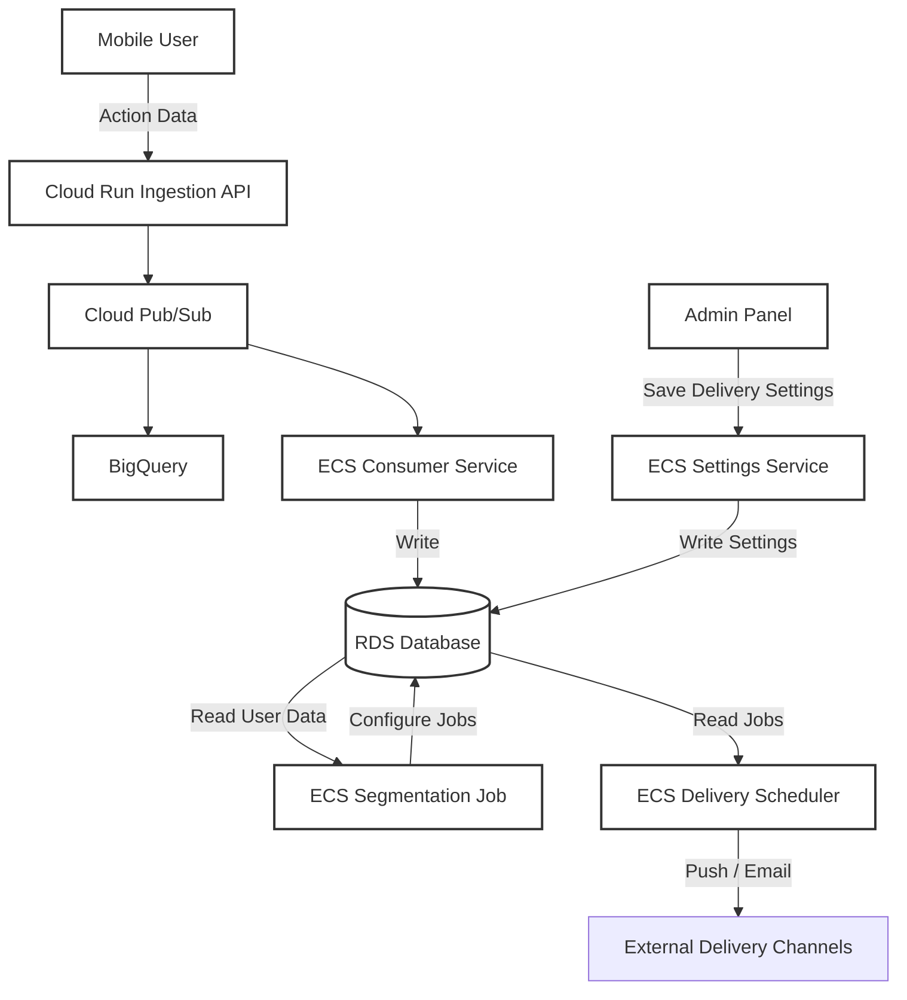

# Behavioral Data Platform

## Overview
This repository hosts a comprehensive system for tracking, segmenting, and acting on user behavioral data from mobile E-commerce applications. The platform handles high-volume event ingestion, processes data for segmentation, and executes multi-channel delivery jobs (Push, Email).

## Tech Stack
The project is structured as a monorepo utilizing the following technologies:
- **Frontend**: Next.js
- **Backend**: Go
- **Infrastructure**:
  - **Compute**: Google Cloud Run, AWS ECS (Fargate)
  - **Messaging**: Google Cloud Pub/Sub
  - **Data Warehouse**: BigQuery
  - **Database**: Amazon RDS

## System Architecture

The following diagram illustrates the data flow from user action to message delivery:



### Data Flow Components
1. **Ingestion**: 
   - Mobile apps send behavioral data (e.g., cart additions, purchases) to the **Cloud Run** endpoint.
   - Data is published to **Pub/Sub** and archived in **BigQuery** for analysis.

2. **Processing**:
   - An **ECS Consumer** service subscribes to the Pub/Sub topic and persists relevant state to **RDS**.

3. **Segmentation**:
   - **ECS Segmentation Tasks** run periodically to analyze user data in RDS based on configuration settings.
   - Targeted delivery jobs are created and stored.

4. **Administration**:
   - **Admin Panel** allows operators to configure delivery rules and settings.
   - Settings are processed by a dedicated **ECS Settings Service** and saved to **RDS**.

5. **Delivery**:
   - **ECS Delivery Schedulers** pick up ready jobs and trigger external delivery APIs for Push Notifications or Emails.

## Project Structure
The repository is organized as a monorepo:

```
.
├── compose.yaml          # Local development orchestration
├── db/                   # Local RDB initialization (schema/seeds)
├── frontend/             # Next.js Admin Panel application
│   ├── package.json
│   └── src/
│       └── app/          # App Router
├── backend/              # Go backend services
│   ├── cmd/              # Service entrypoints
│   │   ├── ingest/       # Cloud Run Ingestion API
│   │   │   └── main.go
│   │   ├── consumer/     # ECS Consumer Service
│   │   │   └── main.go
│   │   ├── settings/     # ECS Settings Service
│   │   │   └── main.go
│   │   ├── segmentation/ # ECS Segmentation Job
│   │   │   └── main.go
│   │   └── delivery/     # ECS Delivery Task
│   │       └── main.go
│   └── internal/         # Private application code and shared libraries
└── terraform/            # Cloud infrastructure definitions (AWS/GCP)
```
